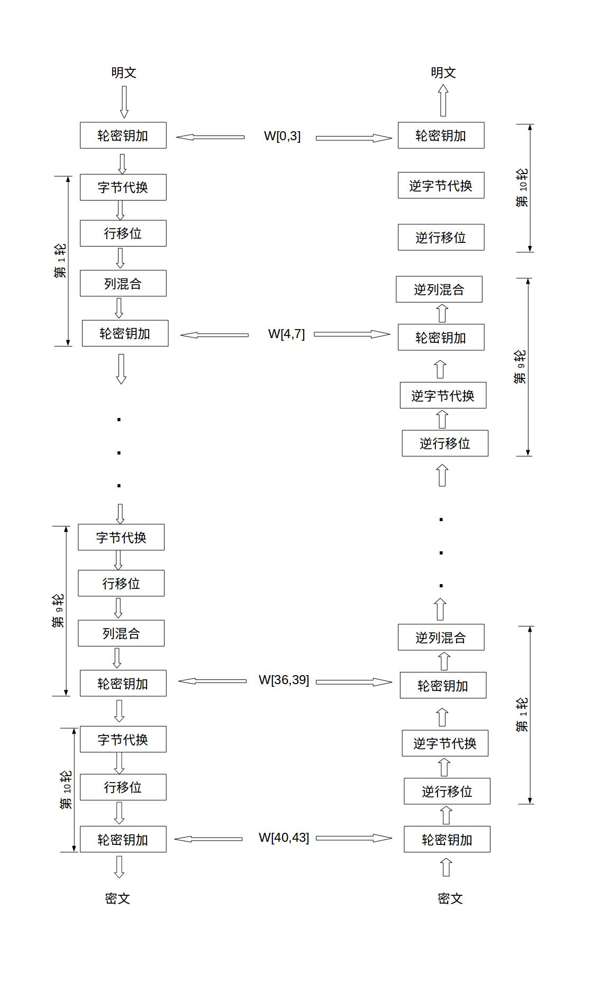
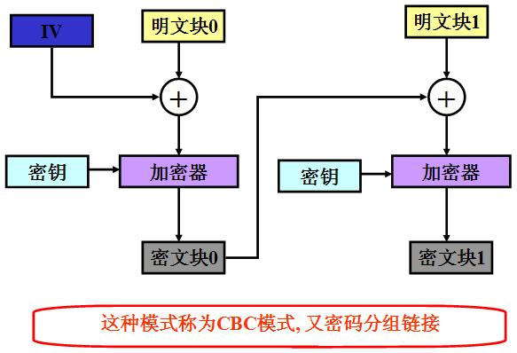

### AES简介

**高级加密标准(AES,Advanced Encryption Standard)**,是最为常见的加密算法，所谓对称加密就是使用相同的密钥进行加密和解密<!--more-->

加密流程如下


密钥可以面对面约定或者使用[非对称加密算法加密]()之后进行传输。


AES为分组密码，分组密码也就是把明文分成组，每组长度相等。每次加密一组数据，直到加密完整个明文。在AES标准规范中，分组长度只能是128位，也就是说，每个分组为16个字节（每个字节8位）。密钥的长度可以使用128位、192位或256位。密钥的长度不同，推荐加密轮数也不同，如下表所示：

| AES     | 密钥长度（32位比特字) | 分组长度(32位比特字) | 加密轮数 |
| ------- | --------------------- | -------------------- | -------- |
| AES-128 | 4                     | 4                    | 10       |
| AES-192 | 6                     | 4                    | 12       |
| AES-256 | 8                     | 4                    | 14       |

- 所谓`AES-128`也就是密钥的长度为128位，加密轮数为10轮。也就是执行一个加密函数十次。但是前九轮执行顺序相同，第十实现才有所不同。

- 解密过程是加密过程的逆过程，调用解密函数

- 加密前九轮每一轮的操作顺序为字节代换、行位移，列位移、列混合，轮密钥加。

  



#### 字节代换和逆字节代换

AES的字节代换其实就是一个简单的查表操作。AES定义了一个[S盒]()和一个[逆S盒]()。

[状态矩阵]()中的元素按照下面的方式映射为一个新的字节：把该字节的高4位作为行值，低4位作为列值，取出S盒或者逆S盒中对应的行的元素作为输出。

#### 行移位

行移位是一个简单的左循环移位操作。当密钥长度为128比特时，状态矩阵的第0行左移0字节，第1行左移1字节，第2行左移2字节，第3行左移3字节。

行移位的逆变换是将状态矩阵中的每一行执行相反的移位操作，例如AES-128中，状态矩阵的第0行右移0字节，第1行右移1字节，第2行右移2字节，第3行右移3字节。

#### 列混合

列混合变换是通过矩阵相乘来实现的，经行移位后的状态矩阵与固定的矩阵相乘，得到混淆后的状态矩阵。

#### 轮密钥加

轮密钥加是将128位轮密钥Ki同状态矩阵中的数据进行逐位异或操作，如下图所示。其中，密钥Ki中每个字W[4i],W[4i+1],W[4i+2],W[4i+3]为32位比特字，包含4个字节，他们的生成算法下面在下面介绍。轮密钥加过程可以看成是字逐位异或的结果，也可以看成字节级别或者位级别的操作。也就是说，可以看成S0 S1 S2 S3 组成的32位字与W[4i]的异或运算。

轮密钥加的逆运算同正向的轮密钥加运算完全一致，这是因为异或的逆操作是其自身。轮密钥加非常简单，但却能够影响S数组中的每一位。


以上为每次轮函数操作流程，调用轮函数之前我们先进行的是对密钥进行拓展。

#### 密钥扩展

1. 先将密钥放入4X4矩阵中，获取每一列组成新的矩阵W1，W2,W3,W4。
2. 扩充矩阵矩阵到44列。


#### 分组明文补全策略

**使用PKCS5、PKCS7和NOPADDING**三种模式进行补全。PKCS5是指分组数据缺少几个字节，就在数据的末尾填充几个字节的几，比如缺少5个字节，就在末尾填充5个字节的5。PKCS7是指分组数据缺少几个字节，就在数据的末尾填充几个字节的0，比如缺少7个字节，就在末尾填充7个字节的0。NoPadding是指不需要填充，也就是说数据的发送方肯定会保证最后一段数据也正好是16个字节。那如果在PKCS5模式下，最后一段数据的内容刚好就是16个16怎么办？那解密端就不知道这一段数据到底是有效数据还是填充数据了，因此对于这种情况，PKCS5模式会自动帮我们在最后一段数据后再添加16个字节的数据，而且填充数据也是16个16，这样解密段就能知道谁是有效数据谁是填充数据了。PKCS7最后一段数据的内容是16个0，也是同样的道理。**解密端需要使用和加密端同样的Padding模式，才能准确的识别有效数据和填充数据。我们开发通常采用PKCS7 Padding模式。**

**注**在17年做该加密方案时候，貌似iOS端使用PKCS7和后端进行加解密开发时候无法成功，换成PKCS7才可以。

##### CBC模式




### RSA加解密流程

#### **第一步：生成密钥对，即公钥和私钥。**

##### 1：随机找两个质数 P 和 Q ,P 与 Q 越大，越安全。

比如 P = 67 ，Q = 71。计算他们的乘积 n = P * Q = 4757 ，转化为二进为 1001010010101，该加密算法即为 13 位，实际算法是 1024 位 或 2048 位，位数越长，算法越难被破解。

##### 2：计算 n 的欧拉函数 φ(n)。

φ(n) 表示在小于等于 n 的正整数之中，与 n 构成互质关系的数的个数。例如：在 1 到 8 之中，与 8 形成互质关系的是1、3、5、7，所以 φ(n) = 4。 如果 n = P * Q，P 与 Q 均为质数，则 φ(n) = φ(P * Q)= φ(P - 1)*φ(Q - 1) = (P - 1)*(Q - 1) 。 本例中 φ(n) = 66 * 70 = 4620，这里记为 m， m = φ(n) = 4620

##### 3：随机选择一个整数 e，条件是1< e < m，且 e 与 m 互质。

公约数只有 1 的两个整数，叫做互质整数，这里我们随机选择 e = 101 请注意不要选择 4619，如果选这个，则公钥和私钥将变得相同。

##### 4：有一个整数 d，可以使得 e*d 除以 m 的余数为 1。

即找一个整数 d，使得 (e * d ) % m = 1。 等价于 e * d - 1 = y * m ( y 为整数） 找到 d ，实质就是对下面二元一次方程求解。 e * x - m * y =1 ，其中 e = 101，m = 4620 101x - 4620y =1 这个方程可以用["扩展欧几里得算法"](https://link.zhihu.com/?target=http%3A//zh.wikipedia.org/wiki/%E6%89%A9%E5%B1%95%E6%AC%A7%E5%87%A0%E9%87%8C%E5%BE%97%E7%AE%97%E6%B3%95)求解，此处省略具体过程。 总之算出一组整数解（x，y ）= （ 1601，35），即 d = 1601。 到此密钥对生成完毕。不同的 e 生成不同的 d，因此可以生成多个密钥对。

本例中公钥为 （n，e) = (4757 , 101)，私钥为 （n，d) = (4757 ，1601) ，仅（n，e) = (4757 , 101) 是公开的，其余数字均不公开。可以想像如果只有 n 和 e，如何推导出 d，目前只能靠暴力破解，位数越长，暴力破解的时间越长。

#### **第二步：加密生成密文 。**

比如甲向乙发送汉字“中”，就要使用乙的公钥加密汉字 "中"， 以 utf-8 方式编码为 [e4 b8 ad]，转为 10 进制为 [228,184,173]。要想使用公钥（n，e) = (4757 , 101)加密，要求**被加密的数字必须小于 n，被加密的数字必须是整数，字符串可以取 ascii 值或unicode值**，因此将“中”字折为三个字节 [228,184,173]，分别对三个字节加密。 假设 a 为明文，b 为密文，则按下列公式计算出 b

```python
a^e % n = b
```

计算 [228,184,173]的密文：

228^101 % 4757 = 4296

184^101 % 4757 = 2458

173^101 % 4757 = 3263

即 [228,184,173]加密后得到密文 [4296，2458，3263] ，如果没有私钥 d ,神仙也无法从 [4296，2458，3263]中恢复 [228,184,173]。

乙收到密文 [4296，2458，3263]，并用自己的私钥（n，d) = (4757 ，1601) 解密。解密公式如下： 假设 a 为明文，b 为密文，则按下列公式计算出 a

```python
a^d % n = b
```

密文 [4296，2458，3263]的明文如下：

4296^1601% 4757 = 228

2458^1601% 4757 = 184

3263^1601% 4757 = 173

即密文 [4296，2458，3263] 解密后得到 [228,184,173] 将[228,184,173] 再按 utf-8 解码为汉字 "中"，至此解密完毕。

**加密和解密的过程使用了费尔马小定理的两种等价的描述**。

### 参考文档

[AES加密算法的详细介绍与实现](https://blog.csdn.net/qq_28205153/article/details/55798628)

[对称加密及AES加密算法](https://www.jianshu.com/p/3840b344b27c)

[一文搞懂 RSA 算法](https://zhuanlan.zhihu.com/p/44185847)

