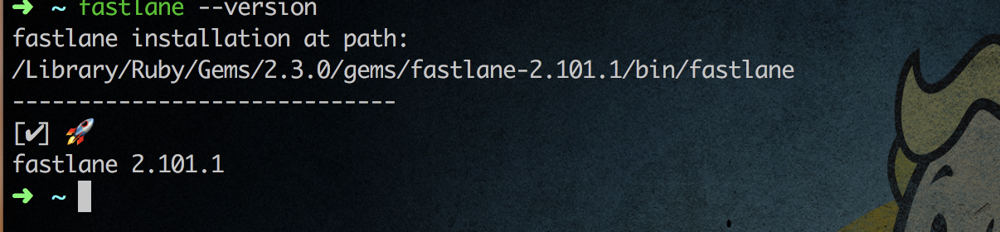
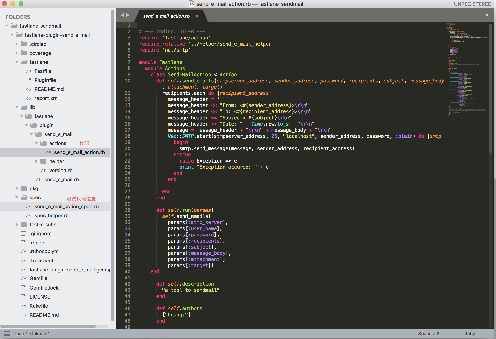

先上[源码](https://github.com/xyhuangjia/fastlane-plugin-send_e_mail)

### 场景

 开发过程中经常需要发布新版本到第三方分发平台，然而很多时候发布新版本后都忘记及时通知相关测试人员新版本已经发布可以进行测试了。（其实是不想吼一嗓子) 于是琢磨是不是有什么方案可以在上传ipa包后可以自动通知相关人员。于是又了下面的一篇水文。
 <!-- more -->

~~**注** sendmail 脚本有缺陷，文本乱码，发送到网易邮箱会被认为是垃圾邮件。后期有时间更新，~~

### 工具

#### fastlane  

首先需要一台安装过fastlane 的机器 ，什么？你没装？没事，打开终端粘贴如下代码

```shell
sudo gem install -n /usr/local/bin fastlane 
```

等待代码运行完毕后键入``fastlane --version``查看fastlane的版本如下图



安装出现问题？别慌！谷歌了解下？

#### ruby基础知识和脚本

不懂ruby？没关系。

look this  [Ruby 教程](http://www.runoob.com/ruby/ruby-tutorial.html) 、[ruby官网](https://www.ruby-lang.org/zh_cn/)。

个人使用的脚本雏形

```ruby
#!/usr/bin/ruby -w
# -*- coding: UTF-8 -*-

require 'net/smtp'
SMTP_SERVER = 'smtp.yeah.net' #change to your server

def send_emails(sender_address,password, recipients, subject, message_body)

    recipients.each do |recipient_address|
        message_header =''
        message_header << "From: <#{sender_address}>\r\n"
        message_header << "To: <#{recipient_address}>\r\n"
        message_header << "Subject: #{subject}\r\n"
        message_header << "Date: " + Time.now.to_s + "\r\n"
        message_header << "MIME-Version: 1.0" + "\r\n"
        message_header << "Content-type: text/html;charset=utf-8" + "\r\n"
        message = message_header + "\r\n" + message_body.encode('utf-8') + "\r\n"
        Net::SMTP.start(SMTP_SERVER,25,"localhost" , sender_address,password ,:plain) do |smtp|
            begin
                # 写出数据 ...
                smtp.send_message message, sender_address, recipient_address
            rescue
                # 发生错误
                raise FileSaveError.new($!)
            end 
        end
    end
end
send_emails("账号","独立密码",["账号"],"用电宝的上线通知","新版本测试包已上传注意查收,新版本测试包已上传注意查收,新版本测试包已上传注意查收新版本测试包已上传注意查收")
```

#### 邮箱配置stmp

emmm 这个不知道怎么操作的请百度吧

### 新建插件

cd到新文件夹后在终端运行如下命令``fastlane new_plugin [plugin_name]``，得到插件工程。



### 测试并发布

- 新建发布账户在[RubyGems.org](https://rubygems.org/)。
- 新建代码远程仓库。
- 更新 `fastlane-plugin-[plugin_name].gemspec` 文件 的 `spec.homepage` 指向远程仓库的 repo。

- 提交代码到远程仓库。
- 运行测试代码

```shell
bundle install
rake install
```

测试通过生成新的安装包后再执行发布操作。

- 发布插件``rake release``

### 资料

- https://fastlane.tools/
- [Fastlane 插件 ](https://docs.fastlane.tools/plugins/create-plugin/)


