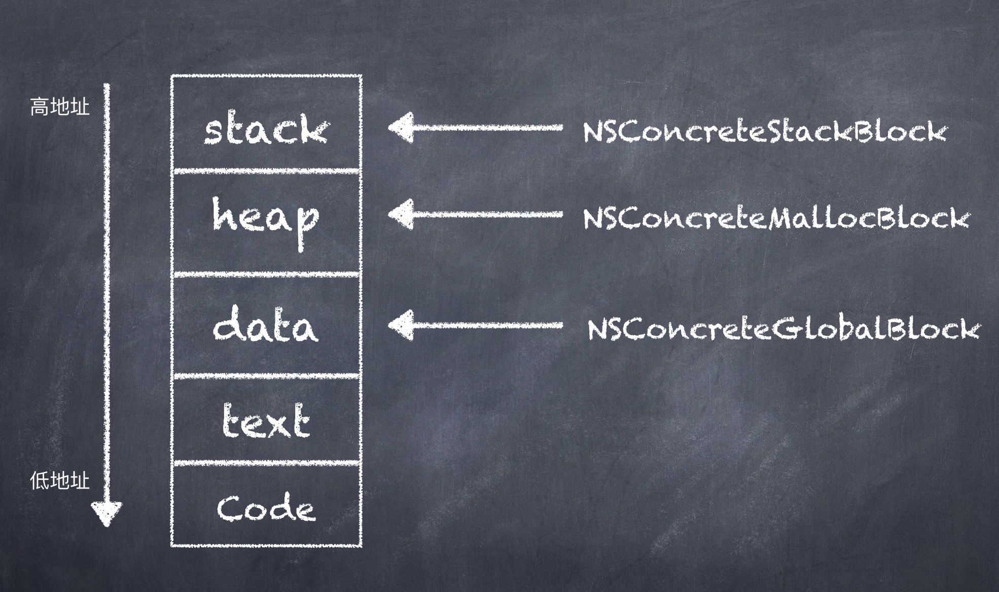

### Block笔记

#### 前置知识点

**栈：**由系统自动分配，一般存放函数参数值、局部变量的值等。由编译器自动创建与释放。其操作方式类似于数据结构中的栈，即后进先出、先进后出的原则。

**堆区（heap）**：一般由程序员申请并指明大小，最终也由程序员释放。如果程序员不释放，程序结束时可能会由OS回收。对于堆区的管理是采用链表式管理的，操作系统有一个记录空闲内存地址的链表，当接收到程序分配内存的申请时，操作系统就会遍历该链表，遍历到一个记录的内存地址大于申请内存的链表节点，并将该节点从该链表中删除，然后将该节点记录的内存地址分配给程序。

**全局区/静态区**：顾名思义，全局变量和静态变量存储在这个区域。只不过初始化的全局变量和静态变量存储在一块，未初始化的全局变量和静态变量存储在一块。程序结束后由系统释放。

**文字常量区**：这个区域主要存储字符串常量。程序结束后由系统释放。

**程序代码区**：这个区域主要存放函数体的二进制代码。
<!-- more -->

<!--  -->

### What

### block什么？

**Block**是带有自动变量的匿名函数。

> **匿名函数**（英语：anonymous function）是指一类无需定义[标识符](https://zh.wikipedia.org/wiki/%E6%A0%87%E8%AF%86%E7%AC%A6)（函数名）的[函数](https://zh.wikipedia.org/wiki/%E5%87%BD%E6%95%B0)或[子程序](https://zh.wikipedia.org/wiki/%E5%AD%90%E7%A8%8B%E5%BA%8F)，普遍存在于多种编程语言中。OC中用block 表示

> **自动变量**（*Automatic Variable*）指的是局部[作用域](https://zh.wikipedia.org/wiki/%E4%BD%9C%E7%94%A8%E5%9F%9F)[变量](https://zh.wikipedia.org/wiki/%E5%8F%98%E9%87%8F_(%E7%A8%8B%E5%BA%8F%E8%AE%BE%E8%AE%A1))，具体来说即是在[控制流](https://zh.wikipedia.org/wiki/%E6%8E%A7%E5%88%B6%E6%B5%81)进入变量作用域时系统自动为其[分配存储空间](https://zh.wikipedia.org/wiki/%E5%86%85%E5%AD%98%E7%AE%A1%E7%90%86)，并在离开作用域时释放空间的一类变量。在许多[程序语言](https://zh.wikipedia.org/wiki/%E7%A8%8B%E5%BA%8F%E8%AA%9E%E8%A8%80)中，自动变量与术语“[局部变量](https://zh.wikipedia.org/wiki/%E5%B1%80%E9%83%A8%E5%8F%98%E9%87%8F)”（*Local Variable*）所指的变量实际上是同一种变量，所以通常情况下“自动变量”与“局部变量”是同义的。自动变量在C与C++中的实现即为“自动变量”（*Automatic Variable*）。默认情况下，在[代码块](https://zh.wikipedia.org/w/index.php?title=%E4%BB%A3%E7%A0%81%E5%9D%97&action=edit&redlink=1)内声明的变量都是自动变量，但亦可用自动变量的关键字auto明确标识[存储类](https://zh.wikipedia.org/w/index.php?title=C%E8%AF%AD%E8%A8%80%E8%AF%AD%E6%B3%95&action=edit&redlink=1)[[1\]](https://zh.wikipedia.org/wiki/%E8%87%AA%E5%8A%A8%E5%8F%98%E9%87%8F#cite_note-1)；而如若使用register（而非auto）存储类标识代码块内的变量，[编译器](https://zh.wikipedia.org/wiki/%E7%BC%96%E8%AF%91%E5%99%A8)就会将变量[缓存](https://zh.wikipedia.org/wiki/%E7%BC%93%E5%AD%98)于[处理器](https://zh.wikipedia.org/wiki/%E5%A4%84%E7%90%86%E5%99%A8)内的[寄存器](https://zh.wikipedia.org/wiki/%E5%AF%84%E5%AD%98%E5%99%A8)中，此种情况下不能对该变量或其[成员变量](https://zh.wikipedia.org/w/index.php?title=%E6%88%90%E5%91%98%E5%8F%98%E9%87%8F&action=edit&redlink=1)使用引用[操作符](https://zh.wikipedia.org/w/index.php?title=%E6%93%8D%E4%BD%9C%E7%AC%A6&action=edit&redlink=1)&以获取其地址，因为&只能获取内存空间中的地址；除此以外，由于寄存器的数量及其所能存储的[数据类型](https://zh.wikipedia.org/wiki/%E6%95%B8%E6%93%9A%E9%A1%9E%E5%9E%8B)受[硬件](https://zh.wikipedia.org/wiki/%E7%A1%AC%E4%BB%B6)限制而可能无法存储指定变量，编译器可以忽略[声明](https://zh.wikipedia.org/w/index.php?title=%E5%A3%B0%E6%98%8E_(%E8%AE%A1%E7%AE%97%E6%9C%BA%E7%BC%96%E7%A8%8B)&action=edit&redlink=1)内的register关键字。对于一个未[初始化](https://zh.wikipedia.org/wiki/%E5%88%9D%E5%A7%8B%E5%8C%96)的自动变量来说，在为其[赋值](https://zh.wikipedia.org/wiki/%E8%B5%8B%E5%80%BC)之前其值都为undefined（未定义）[[2\]](https://zh.wikipedia.org/wiki/%E8%87%AA%E5%8A%A8%E5%8F%98%E9%87%8F#cite_note-2)。
>
> 在C++中，如谚语“[资源获取即初始化](https://zh.wikipedia.org/wiki/%E8%B5%84%E6%BA%90%E8%8E%B7%E5%8F%96%E5%8D%B3%E5%88%9D%E5%A7%8B%E5%8C%96)”（*Resource Acquisition Is Initialization*，常缩写为RAII）所述，自动变量的[构造函数](https://zh.wikipedia.org/wiki/%E6%9E%84%E9%80%A0%E5%87%BD%E6%95%B0)在程序运行至声明部分的时候才会被调用，而当程序运行至所给的程序块末端的时候则调用[析构函数](https://zh.wikipedia.org/wiki/%E6%9E%90%E6%9E%84%E5%87%BD%E6%95%B0)，这一特性常应用于资源的分配与释放管理，如自动关闭已开启的[文件](https://zh.wikipedia.org/wiki/%E6%96%87%E4%BB%B6)或自动释放空闲内存。

 形如 `^ 返回值类型 (参数列表) {表达式}`（我想起高中的一位数学老师定义概念时候的用法）

```objective-c
^ int (int count) {
        return count + 1;
    };
```

可以省略返回值和参数，最终如下

```objective-c
^ {
    NSLog(@"No Parameter");
  };
```

例子：

```objective-c
int a = 0; //全局初始化
char *p1; //全局未初始化区
int main(int argc, const char * argv[]) {
    @autoreleasepool {

        int b; //栈
        char s[] = "abc"; //栈
        char *p2; //栈
        char *p3 = "123456"; //123456 在常量区，p3在栈区
        static int c = 0; //全局静态初始化区
        p1 = (char *)malloc(10);
        p2 = (char *)malloc(10); // 手动分配是分配在堆区
        strcpy(p1, "123456"); // 123456在常量区m，这个函数的作用是将“123456”。p3指向的“123456”与这里的123456可能被编译器优化成一个地址
        NSLog(@"%c",*p1);
    }
    return 0;
}
```

有兴趣自看源代码

```c++
struct __ViewController__viewDidLoad_block_impl_0 {
  struct __block_impl impl;
  struct __ViewController__viewDidLoad_block_desc_0* Desc;
  NSMutableArray *array;
  __ViewController__viewDidLoad_block_impl_0(void *fp, struct __ViewController__viewDidLoad_block_desc_0 *desc, NSMutableArray *_array, int flags=0) : array(_array) {
    impl.isa = &_NSConcreteStackBlock;
    impl.Flags = flags;
    impl.FuncPtr = fp;
    Desc = desc;
  }
};
/*block内部调用的方法*/
static void __ViewController__viewDidLoad_block_func_0(struct __ViewController__viewDidLoad_block_impl_0 *__cself) {
  NSMutableArray *array = __cself->array; // bound by copy

        ((void (*)(id, SEL, NSUInteger))(void *)objc_msgSend)((id)array, sel_registerName("removeObjectAtIndex:"), (NSUInteger)0);

    }
static void __ViewController__viewDidLoad_block_copy_0(struct __ViewController__viewDidLoad_block_impl_0*dst, struct __ViewController__viewDidLoad_block_impl_0*src) {
    _Block_object_assign((void*)&dst->array, (void*)src->array, 3/*BLOCK_FIELD_IS_OBJECT*/);
}

static void __ViewController__viewDidLoad_block_dispose_0(struct __ViewController__viewDidLoad_block_impl_0*src) {_Block_object_dispose((void*)src->array, 3/*BLOCK_FIELD_IS_OBJECT*/);}

static struct __ViewController__viewDidLoad_block_desc_0 {
  size_t reserved; 
  size_t Block_size;
  void (*copy)(struct __ViewController__viewDidLoad_block_impl_0*, struct __ViewController__viewDidLoad_block_impl_0*);
  void (*dispose)(struct __ViewController__viewDidLoad_block_impl_0*);
} __ViewController__viewDidLoad_block_desc_0_DATA = { 0, sizeof(struct __ViewController__viewDidLoad_block_impl_0), __ViewController__viewDidLoad_block_copy_0, __ViewController__viewDidLoad_block_dispose_0};

static void _I_ViewController_viewDidLoad(ViewController * self, SEL _cmd) {
    ((void (*)(__rw_objc_super *, SEL))(void *)objc_msgSendSuper)((__rw_objc_super){(id)self, (id)class_getSuperclass(objc_getClass("ViewController"))}, sel_registerName("viewDidLoad"));
    NSMutableArray *array = ((NSMutableArray *(*)(id, SEL, ObjectType _Nonnull, ...))(void *)objc_msgSend)((id)((NSMutableArray *(*)(id, SEL))(void *)objc_msgSend)((id)objc_getClass("NSMutableArray"), sel_registerName("alloc")), sel_registerName("initWithObjects:"), (id _Nonnull)(NSString *)&__NSConstantStringImpl__var_folders_f7___d4s9f93n5c4xh77y4hd5880000gp_T_ViewController_7587fa_mi_0, (NSString *)&__NSConstantStringImpl__var_folders_f7___d4s9f93n5c4xh77y4hd5880000gp_T_ViewController_7587fa_mi_1, __null);
    NSLog((NSString *)&__NSConstantStringImpl__var_folders_f7___d4s9f93n5c4xh77y4hd5880000gp_T_ViewController_7587fa_mi_2, ((NSUInteger (*)(id, SEL))(void *)objc_msgSend)((id)array, sel_registerName("count")));
    void (*blk)(void) = ((void (*)())&__ViewController__viewDidLoad_block_impl_0((void *)__ViewController__viewDidLoad_block_func_0, &__ViewController__viewDidLoad_block_desc_0_DATA, array, 570425344));
    /*block函数调用*/
    ((void (*)(__block_impl *))((__block_impl *)blk)->FuncPtr)((__block_impl *)blk);
    NSLog((NSString *)&__NSConstantStringImpl__var_folders_f7___d4s9f93n5c4xh77y4hd5880000gp_T_ViewController_7587fa_mi_3, ((NSUInteger (*)(id, SEL))(void *)objc_msgSend)((id)array, sel_registerName("count")));

}
```

提取关键信息

```c++
struct Block_descriptor {
    unsigned long int reserved;
    unsigned long int size;
    void (*copy)(void *dst, void *src);
    void (*dispose)(void *);
};
 
struct Block_layout {
    void *isa; //isa指针：指向表明该block类型的类。
    int flags; //flags：按bit位表示一些block的附加信息，比如判断block类型、判断block引用计数、判断block是否需要执行辅助函数等。
    int reserved; //reserved：保留变量，我的理解是表示block内部的变量数。
    void (*invoke)(void *, ...); //invoke：函数指针，指向具体的block实现的函数调用地址。
    struct Block_descriptor *descriptor; //descriptor：block的附加描述信息，比如保留变量数、block的大小、进行copy或dispose的辅助函数指针。
    /* Imported variables. */
};
```

#### Block的类型

Block常见的一般有三种类型：`NSConcreteGlobalBlock`、`_NSConcreteStackBlock`、`NSConcreteMallocBlock`。还有几种在GC环境下使用的_`NSConcreteFinalizingBlock` `_NSConcreteAutoBlock``_NSConcreteWeakBlockVariable`。

##### _NSConcreteGlobalBlock

- 未捕获外部变量。在 [static void computeBlockInfo(CodeGenModule &CGM, CodeGenFunction *CGF,CGBlockInfo &info)](https://link.jianshu.com?t=http://clang.llvm.org/doxygen/CGBlocks_8cpp_source.html#l00326) 函数内的 [334行](https://link.jianshu.com?t=http://clang.llvm.org/doxygen/CGBlocks_8cpp_source.html#l00334) 至 [339行](https://link.jianshu.com?t=http://clang.llvm.org/doxygen/CGBlocks_8cpp_source.html#l00339)，通过判断 block(以及嵌套的block) 是否捕捉了本地存储(原文为：local storage)，未捕获时，block 会初始化为 `_NSConcreteGlobalBlock` 。

```c++
if (!block->hasCaptures()) {
   info.StructureType =
     llvm::StructType::get(CGM.getLLVMContext(), elementTypes, true);
   info.CanBeGlobal = true;
   return;
 }
```


- 当需要布局（layout）的变量的数量为0时。

  在
   [static void computeBlockInfo(CodeGenModule &CGM, CodeGenFunction *CGF,CGBlockInfo &info)](https://link.jianshu.com?t=http://clang.llvm.org/doxygen/CGBlocks_8cpp_source.html#l00326)函数内，通过计算 block 的布局(layout)。当需要布局的变量为0时，block 会初始化为 `_NSConcreteGlobalBlock` 。

```
统计需要布局（layout）的变量：
* `this` (为了访问 `c++` 的成员变量和函数，需要 `this` 指针)
* 依次按下列规则处理捕获的变量：
    * 不需要计算布局的变量：
        * 生命周期为静态的变量（被 `const` `static` 修饰的变量，不被函数包含的静态常量，c++中生命周期为静态的变量）
        * 函数参数
    * 需要计算布局的变量：被 `__block` 修饰的变量，以上未提到的类型（比如block）

 
**Tips**：当需要布局（layout）的变量的统计完毕后，会按照以下顺序进行一次稳定排序。
 
*  __strong 修饰的变量
*  ByRef 类型
*  __weak 修饰的变量
*  其它类型
```

##### _NSConcreteMallocBlock

在非垃圾收集环境下，当 `_NSConcreteStackBlock` 类型的block 被真正复制时，在 `_Block_copy_internal` 方法内部，会转换为 `_NSConcreteMallocBlock` [libclosure-65/runtime.c](https://link.jianshu.com?t=http://opensource.apple.com/source/libclosure/libclosure-65/runtime.c)

```c++
// Its a stack block.  Make a copy.
if (!isGC) {
    struct Block_layout *result = malloc(aBlock->descriptor->size);
    if (!result) return NULL;
    memmove(result, aBlock, aBlock->descriptor->size); // bitcopy first
    // reset refcount
    result->flags &= ~(BLOCK_REFCOUNT_MASK|BLOCK_DEALLOCATING);    // XXX not needed
    result->flags |= BLOCK_NEEDS_FREE | 2;  // logical refcount 1
    result->isa = _NSConcreteMallocBlock;
    _Block_call_copy_helper(result, aBlock);
    return result;
}
```

##### _NSConcreteFinalizingBlock&_NSConcreteAutoBlock

在垃圾收集环境下，当 block 被复制时，如果block 有 ctors & dtors 时，则会转换为 `_NSConcreteFinalizingBlock` 类型，反之，则会转换为 `_NSConcreteAutoBlock` 类型

```c++
if (hasCTOR) {
    result->isa = _NSConcreteFinalizingBlock;
}
else {
    result->isa = _NSConcreteAutoBlock;
}
```

##### _NSConcreteWeakBlockVariable

GC环境下，当对象被 `__weak __block` 修饰，且从栈复制到堆时，block 会被标记为 `_NSConcreteWeakBlockVariable` 类型。

```c++
bool isWeak = ((flags & (BLOCK_FIELD_IS_BYREF|BLOCK_FIELD_IS_WEAK)) == (BLOCK_FIELD_IS_BYREF|BLOCK_FIELD_IS_WEAK));
// if its weak ask for an object (only matters under GC)
struct Block_byref *copy = (struct Block_byref *)_Block_allocator(src->size, false, isWeak);
copy->flags = src->flags | _Byref_flag_initial_value; // non-GC one for caller, one for stack
copy->forwarding = copy; // patch heap copy to point to itself (skip write-barrier)
src->forwarding = copy;  // patch stack to point to heap copy
copy->size = src->size;
if (isWeak) {
  copy->isa = &_NSConcreteWeakBlockVariable;  // mark isa field so it gets weak scanning
}
```


```objective-c
 NSLog(@"\n--------------------全局Block---------------------\n");
    
    void (^blk)(void) = ^{
        NSLog(@"Global Block");
    };
    blk();
    NSLog(@"Global Block Addres:%p", blk);
    NSLog(@"%@", [blk class]);
    
    NSLog(@"\n--------------------堆Block---------------------\n");
    
    int i = 1;
    void (^blka)(void) = ^{
        NSLog(@"Malloc Block, %d", i);
    };
    blka();
    NSLog(@"Malloc Block Address:%p", blka);
    NSLog(@"%@", [blka class]);
    
    NSLog(@"\n--------------------栈Block---------------------\n");

    __weak void (^blkb)(void) = ^{
        NSLog(@"Stack Block, %d", i);
    };
    blkb();
    NSLog(@"Stack Block Address:%p", blkb);
    NSLog(@"%@", [blkb class]);
```

输出结果

```objective-c
2018-09-11 17:02:46.791542+0800 BlockDemo[37483:492370] 
--------------------全局Block---------------------

2018-09-11 17:02:46.791670+0800 BlockDemo[37483:492370] Global Block
2018-09-11 17:02:46.791761+0800 BlockDemo[37483:492370] Global Block Addres:0x1098a70c8
2018-09-11 17:02:46.791836+0800 BlockDemo[37483:492370] __NSGlobalBlock__
2018-09-11 17:02:46.792008+0800 BlockDemo[37483:492370] 
--------------------堆Block---------------------

2018-09-11 17:02:46.792151+0800 BlockDemo[37483:492370] Malloc Block, 1
2018-09-11 17:02:46.792288+0800 BlockDemo[37483:492370] Malloc Block Address:0x60800025a910
2018-09-11 17:02:46.792410+0800 BlockDemo[37483:492370] __NSMallocBlock__
2018-09-11 17:02:46.792653+0800 BlockDemo[37483:492370] 
--------------------栈Block---------------------

2018-09-11 17:02:46.792742+0800 BlockDemo[37483:492370] Stack Block, 1
2018-09-11 17:02:46.792942+0800 BlockDemo[37483:492370] Stack Block Address:0x7ffee6357a10
2018-09-11 17:02:46.793101+0800 BlockDemo[37483:492370] __NSStackBlock__

```

But why?

### Why

*从数据结构上分析*

copy stack to heap

```objective-c
// Copy, or bump refcount, of a block.  If really copying, call the copy helper if present.
void *_Block_copy(const void *arg) {
    struct Block_layout *aBlock;

    if (!arg) return NULL;
    
    // The following would be better done as a switch statement
    aBlock = (struct Block_layout *)arg;
    if (aBlock->flags & BLOCK_NEEDS_FREE) {
        // latches on high
        latching_incr_int(&aBlock->flags);
        return aBlock;
    }
    else if (aBlock->flags & BLOCK_IS_GLOBAL) {
        return aBlock;
    }
    else {
        // Its a stack block.  Make a copy.
        struct Block_layout *result = malloc(aBlock->descriptor->size);
        if (!result) return NULL;
        memmove(result, aBlock, aBlock->descriptor->size); // bitcopy first
        // reset refcount
        result->flags &= ~(BLOCK_REFCOUNT_MASK|BLOCK_DEALLOCATING);    // XXX not needed
        result->flags |= BLOCK_NEEDS_FREE | 2;  // logical refcount 1
        _Block_call_copy_helper(result, aBlock);
        // Set isa last so memory analysis tools see a fully-initialized object.
        result->isa = _NSConcreteMallocBlock;
        return result;
    }
}

```

block的实现原理是C语言的函数指针。 函数指针即函数在内存中的地址，通过这个地址可以达到调用函数的目的。

Block是NSObject的子类，拥有NSObject的所有属性，所以block对象也有自己的生命周期，生存期间也会被持有和释放。

### How

吹了半天牛B，这玩意有啥用啊？听我慢慢道来！

### 参考资料

https://blog.csdn.net/Deft_MKJing/article/details/53165799

[iOS block之三种block](https://blog.csdn.net/Mo_Mo123/article/details/77923634)

[Block的使用](http://m6830098.github.io/2016/03/13/Block%E4%BD%BF%E7%94%A8/)