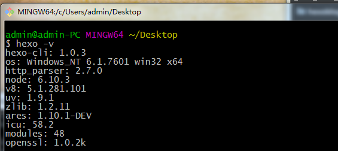
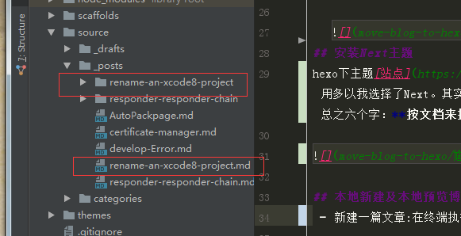
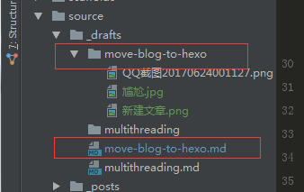
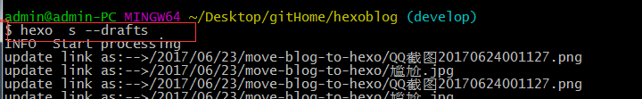

---
title: 博客迁移至Hexo
categories: 杂谈
date: 2017-06-26 22:25:58
tags:
---

## 起因
>之前博客是使用jekyll主题下建立的，渐渐的觉得jekyll使用起来有点麻烦（主要是我懒···）。其页面修改需要自己亲手操刀修改，渐渐的丧失了热情。我需要一个简单的，便于维护的，功能(或插件)齐全的主题。后来，在看到戴铭和南峰子两位大佬的博客时，一下子就被这种主题吸引住了。于是就便有了这篇水文。
<!-- more -->
## Windows系统下安装流程
Mac客户端下安装是没费什么力气的，主要配置的东西已经安装过。直接使用vpn执行下载操作就好。本文主要叙述在windows7环境下安装的流程。

### 工具
 - git 在hexo官网其实已经给过下载地址，为了后来者的方便还是给出[下载链接](https://github.com/waylau/git-for-win)
 - node.js 下载地址hexo官网也给出了[下载地址](https://nodejs.org/en/)
 - npm（cnpm） 这个执行下载命令时候很卡，即使我切换镜像后依然如此。后来查资料后得知使用插件（？目前不太懂，没深究）cnpm 相关命令亦可以达到目的。
 #### cnpm安装 
 ```
npm install cnpm -g --registry=https://registry.npm.taobao.org
 ```
 #### 安装hexo
```
 cnpm install -g hexo-cli
```

   安装成功后输入命令` hexo -v`得到如下结果。

   
## 安装Next主题
hexo下主题[站点](https://github.com/hexojs/hexo/wiki/Sites)很多。我个人觉得Next很好很实用多以我选择了Next。其实按照官网的流程来的话根本就没有任何难度，上面前一句话完全就是废话。总之六个字：**按文档来操作！！！！**


## 本地新建及本地预览博客
### 新建文章
 - 新建一篇文章:在终端执行命令`hexo new "filename" `后会新建一篇文章，得到类似如下结果截图

 

 - 新建私密文章：有时候写完一篇文章，暂时我们觉得文章有些细节不够完美，还需要慢慢的打磨一下。我希望在本地能够预览但是不需要部署到站点上，你可以通过执行`hexo new draft "filename"`来新建一片私密文章，得到类似如下的截图。

 


### 本地预览文章
  - 本地预览文章。
   - 本地预览私密文章：你可以通过在终端执行`hexo server --drafts`得到如下结果
      
   - 本地预览文章：你可以通过在终端执行`hexo server -g`来实现

### 部署文章到站点
  当完成文章，决定发布到站点时候可以在命令行执行`hexo deploy -generate`或者`hexo d -g`完成
## 常用的hexo命令
```
npm install hexo -g #安装  
npm update hexo -g #升级  
hexo init #初始化

hexo new "postName" #新建文章
hexo new page "pageName" #新建页面
hexo generate #生成静态页面至public目录
hexo server #开启预览访问端口（默认端口4000，'ctrl + c'关闭server）
hexo deploy #将.deploy目录部署到GitHub
hexo help  # 查看帮助
hexo version  #查看Hexo的版本
hexo deploy -g  #生成加部署
hexo server -g  #生成加预览

#命令的简写
hexo n == hexo new
hexo g == hexo generate
hexo s == hexo server
hexo d == hexo deploy

#草稿
创建私密文章
hexo new draft "new draft"
预览私密文章
hexo server --drafts
发布私密文章
hexo publish [layout] <filename>

hexo publish draft + 文章文件名

```

##  后记
其实我个人觉得迁移博客到hexo的关键点在于阅读并理解next与hexo的官网的流程与步骤。记住相关的命令。一步步的按照相关文档来，出现问题不惊慌多谷歌，问题会迎刃而解（其实前人都踏过坑了）。


