&emsp;&emsp;&emsp;&emsp;**注：**本文初次发布是在2017年01月18日。从那以后我意识到缺失了工程重命名过程的一个部分。重读的或者直接去阅读新增的部分。

&emsp;&emsp;&emsp;&emsp;有时你需要去重新命名对的你的xcode工程,不久以前，这个还是可能会造成困难，苹果已经有一个工程重命名的工具，但是它依然不满我的需求。我会告诉你如何超越标准功能，以获得我真正想要的东西。让我们去通过看一个实例，我们已经在这个帖子[“The UICollectionView is much more than a grid or matrix”](http://iosbrain.com/blog/2017/01/15/the-uicollectionview-is-much-more-than-a-grid-or-matrix/)(译者注：打开过毛都没有)讨论过重命名一个工程。
<!-- more -->
**简单的重命名**

&emsp;&emsp;&emsp;&emsp;首先，我制作了一个包含该项目的“UICollectionView  -  Starter”目录的副本。在Finder中，我右键单击“UICollectionView  -  Starter”目录并选择“Duplicate”。所以现在我有一个我的原始Xcode项目的副本，名为“UICollectionView  -  Starter copy”的目录。

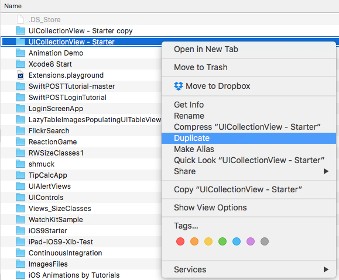

&emsp;&emsp;&emsp;&emsp;然后，我打开这个工程的新副本在xcode8.2.1中。我有多个版本的xcode安装在我电脑中。选中UICollectionView – Starter.xcodeproj右击，以“Xcode.app (default) (8.2.1)打开。

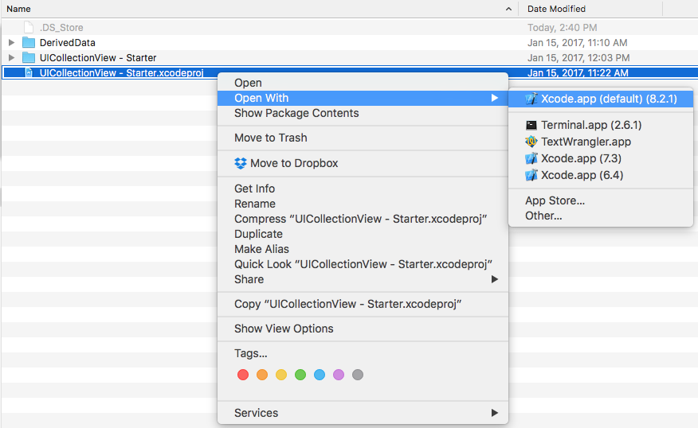

&emsp;&emsp;&emsp;&emsp;Xcode打开后，在Project Navigator中选择项目。您的项目由它的名称和一个蓝色的图标表示。你会看到它在左边的Xcode的顶端。

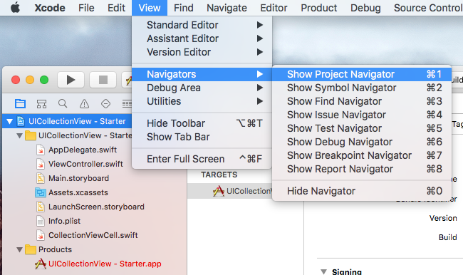

&emsp;&emsp;&emsp;&emsp;在Project Navigator中选择项目后，转到Xcode右上方，打开文件检查器。在顶部（“身份和类型”）中，将光标放在项目“名称”文本字段中。将项目从“UICollectionView  -  Starter”重命名为“UICollectionView  -  PerformBatchUpdates”，然后按键盘上的[return]键（点击放大）：

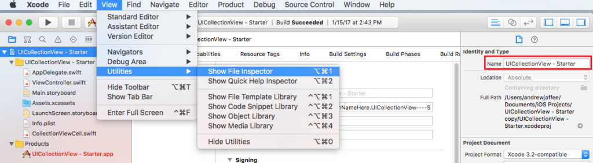

（如果碰巧让Finder运行，你会注意到项目文件被立即重命名为“UICollectionView  -  PerformBatchUpdates.xcodeproj”。）


&emsp;&emsp;&emsp;&emsp;将打开一个名为“重命名项目内容项目？”的对话框，显示两列：左侧展开的项目文件系统树视图（“当前”），以及右侧提出的项目名称更改（“更改”）。确保所有复选框在左侧勾选，然后点击对话框的“重命名”按钮（点击放大）：

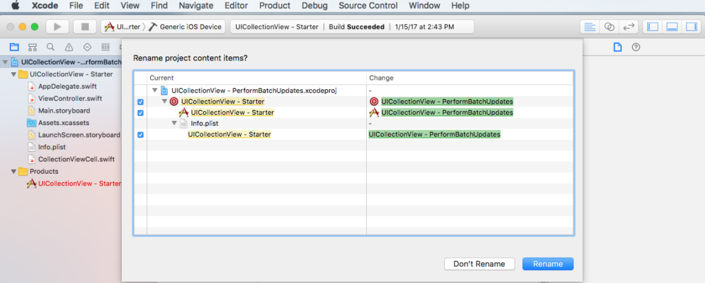

&emsp;&emsp;&emsp;&emsp;最后，将项目的home/root文件夹从“UICollectionView  -  Starter copy”重命名为“UICollectionView  -  PerformBatchUpdates”。构建时不要惊慌，Xcode告诉你：
```Missing required module SwiftShims.PCH was compiled with module cache path [OldPath] but the path is currently [NewPath].```

&emsp;&emsp;&emsp;&emsp;只需删除```/path/to/your/project/UICollectionView - PerformBatchUpdates/DerivedData/ModuleCache```目录。注意：您的“DerivedData”目录的路径可能会有所不同。转到Xcode菜单，然后选择首```Preferences… -> Locations -> Derived Data```，以了解此数据在您的Mac上的位置。

你完成了！项目更名... 但...

**高级重命名**

&emsp;&emsp;&emsp;&emsp;如果您是高级开发人员，并希望进行更精细的控制，请继续阅读。

&emsp;&emsp;&emsp;&emsp;您可能会注意到，并非所有内容都被重命名。如果您查看Project Navigator，您会注意到存储所有应用程序最重要的文件和软件包的默认逻辑（通常为虚拟的）“组” - 如AppDelegate.swift，ViewController.swift，您的故事板，您的资产目录等 - 未更名。当您启动新的Xcode项目时，创建该组。

&emsp;&emsp;&emsp;&emsp;如果您是像我这样的详细信息，您可以重命名项目的主文件“组”。在“简单”的说明中拿起你离开的地方，就像以前一样，在Project Navigator中选择黄色的“UICollectionView  -  Starter”，然后转到文件检查器 - >身份和类型 - >名称文本字段，键入“UICollectionView  -  Core Files”，然后按[return]。

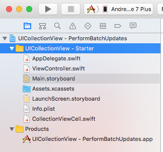

请注意，这并没有重命名相应的macOS文件系统目录。改变：

&emsp;&emsp;&emsp;&emsp;1）进入Finder中的主项目文件夹，并将子文件夹“UICollectionView  -  Starter”重命名为“UICollectionView  -  Core Files”（如果您注意到项目导航器中的文件变红 - 我们即将解决此问题，请不要惊慌） ;

&emsp;&emsp;&emsp;&emsp;2）单击文件检查器 - >身份和类型 - >位置下的小文件夹图标，当目录选择器对话框/面板出现时，选择刚被重命名为“UICollectionView  -  Core Files”的文件夹，然后点击“选择“按钮;

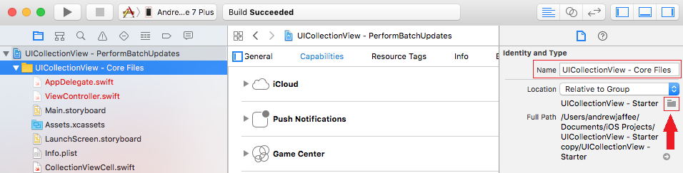
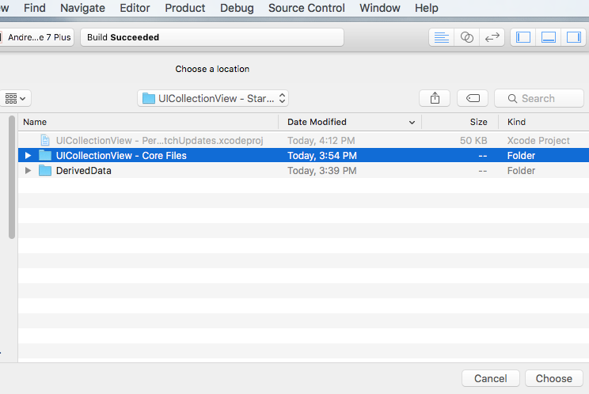

&emsp;&emsp;&emsp;&emsp;3）建立Xcode时不要惊慌，Xcode会告诉您Info.plist丢失，只需转到Project Navigator  - > [您的项目名称]  - > Build Settings  - > Packaging  - > Info.plist File，然后更改路径的子串从“入门”到“核心文件”。

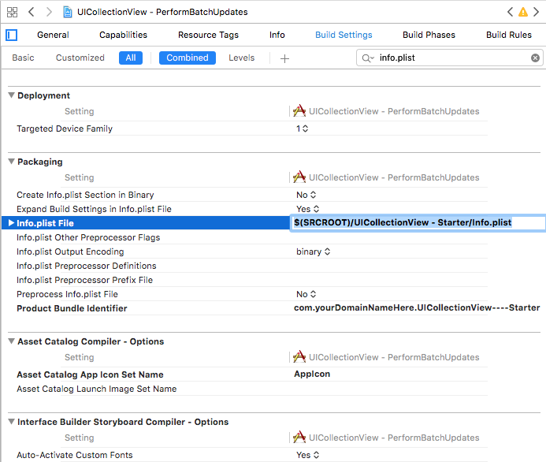

&emsp;&emsp;&emsp;&emsp;4）重要信息：删除```/path/to/your/project/UICollectionView-PerformBatchUpdates/DerivedData/ModuleCache```目录。

&emsp;&emsp;&emsp;&emsp;请注意，大多数项目应该组织起来，将文件分解为至少逻辑组，最好是基于物理目录的单元（例如“View Controllers”，“Data Model”，“Collection View Cell”，“Page View Controllers”，“Core功能 -  C ++“，”无论如何“等）

&emsp;&emsp;&emsp;&emsp;5）最后，您应该重命名Xcode项目的“方案”。当您像本教程一样创建一个新项目时，只会有一个方案。做一些研究，找出为什么你可能 - 也许应该 - 有很多计划。计划经理列出了您的项目可以构建的所有最终产品。例如，您可以使用计划来构建应用程序的调试或发布版本（“可执行文件”），“归档文件”以提交给App Store（“.ipa”），测试协议等。请注意，在我们重命名之后，该项目的方案尚未重命名（点击放大）：


您需要点击当前方案并选择“管理方案...”，如下所示（点击放大）：

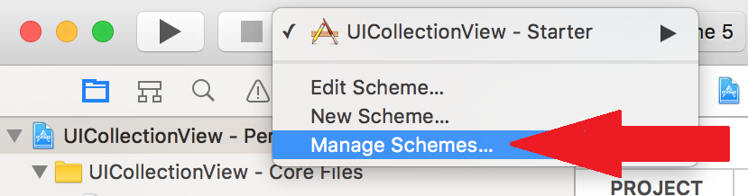

在打开的对话框中，将方​​案重命名为新项目名称，然后单击“关闭”按钮（点击放大）：

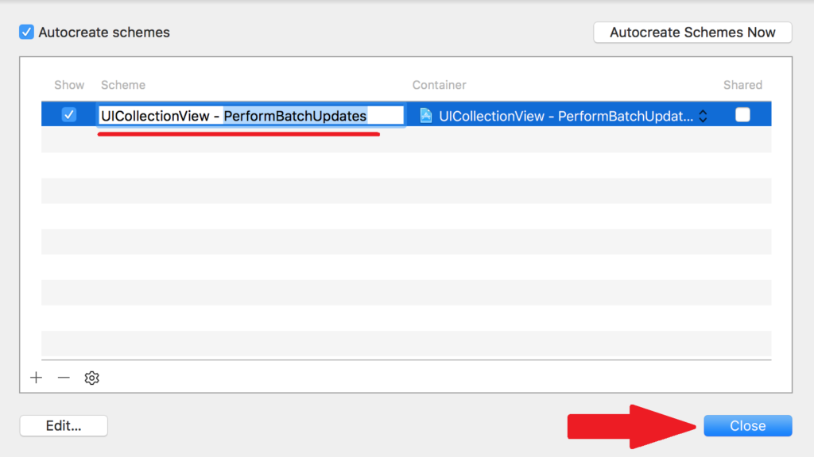


&emsp;&emsp;&emsp;&emsp;所以现在你已经学会了如何重命名一个Xcode项目。相信我，会有一段时间，你需要这样做。在我们继续讨论充分利用UICollectionView的时候回来吧。

**[原文链接](http://iosbrain.com/blog/2017/01/18/renaming-an-xcode-8-project-the-easy-way-or-the-advanced-way/)** 

**注：**如有任何疑问请发邮件到xyhuangjia@yeah.net联系我