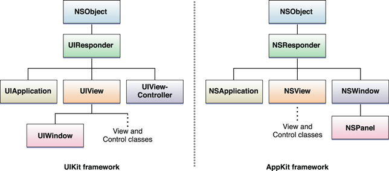

## 起因

>昨天遇到了一个bug：当页面上的一个输入框获得焦点后，点击页面上的任何部分位置会造成无输出崩溃信息的闪退，崩溃率达到100%。bug能够重现但是无法精准定位到崩溃位置，纵然我开了全局断点。由于在异常收集工具上显示的responder相关信息。暂时断定是事件在传递过程出现了问题。
<!-- more -->
## 资料

在查找问题时候我觉得我们应该去查找第一手资料，对于iOS开发者来讲最好的资料就是官网的文档了，我们应该先看看官方文档对[响应者对象](https://developer.apple.com/library/content/documentation/General/Conceptual/Devpedia-CocoaApp/Responder.html)和[响应者和响应者链](https://developer.apple.com/library/content/documentation/EventHandling/Conceptual/EventHandlingiPhoneOS/HandlngEventsUsingtheResponderChain.html#//apple_ref/doc/uid/TP40009541-CH11-SW1)的解释。鉴于很多同学不愿意阅读英文文档，我将其翻译部分摘录如下：
### 响应者对象
>响应者是可以响应事件并处理它们的对象。所有响应者对象都是最终从UIResponder（iOS）或NSResponder（OS X）继承的类的实例。 这些类声明一个用于事件处理的编程接口，并为响应者定义一个默认行为。 应用程序的可见对象几乎总是响应者，例如Windows，视图和控件，而应用对象也是响应者。 在iOS中，视图控制器（UIViewController对象）也是响应器对象。


>为了接收事件，响应者必须实施适当的事件处理方法，并且在某些情况下告诉应用程序它可以成为第一个响应者。

>**第一个响应者首先收到一些事件**
>在应用程序中，首先接收到多种事件的响应者对象被称为第一响应者。 它接收关键事件，动作事件和动作消息等。 （鼠标事件和多点触摸事件首先转到鼠标指针或手指下方的视图;该视图可能或可能不是第一个响应者。）第一个响应者通常是应用程序认为最适合处理的窗口中的视图 一个事件。 为了收到一个事件，答复者还必须表明愿意成为第一反应者; 它为每个平台以不同的方式进行：

```
// OS X
- (BOOL)acceptsFirstResponder { return YES; }
 
//iOS
- (BOOL)canBecomeFirstResponder { return YES; }
```

>除了接收到事件消息之外，响应者还可以接收到没有指定目标的动作消息。 （当用户操纵消息时，操作消息由诸如按钮和控件之类的控件发送。）

>**响应者链启用合作事件处理**
>如果第一响应者无法处理事件或动作消息，则将其转发到称为响应者链的链接系列中的“下一个响应者”。 响应者链允许响应者对象将处理事件或操作消息的责任转移到应用程序中的其他对象。 如果响应者链中的对象无法处理事件或操作，则会将消息传递给链中的下一个响应者。 该消息沿链条向上移动到更高级别的对象，直到被处理。 如果没有处理，应用程序将其丢弃。


>**事件的路径** 响应者链中的事件的一般路径从视图开始 - 第一响应者或鼠标指针或手指下的视图。 从那里，它将视图层次结构上升到窗口对象，然后到全局应用对象。 然而，iOS中的事件响应者链对此路径添加了一个变体：如果视图由视图控制器管理，并且视图无法处理事件，则视图控制器将成为下一个响应者。

>**行动讯息的路径**。 对于动作消息，OS X和iOS都将响应者链扩展到其他对象。 在OS X中，针对应用程序的响应者链基于文档体系结构，使用窗口控制器（NSWindowController）的应用程序和不适合这些类别的应用程序的应用程序链不同。 另外，如果OS X上的某个应用程序同时具有键窗口和主窗口，则动作消息所沿着的响应器链可能涉及两个窗口的视图层次结构。

### 响应者和响应者链
>应用程序使用responder对象接收和处理事件。响应者对象是UIResponder类的任何实例，常见的子类包括UIView，UIViewController和UIApplication。 UIKit自动管理大多数响应者相关的行为，包括事件如何从一个响应者传递到下一个。但是，您可以修改默认行为来更改事件在应用程序中的传送方式。

>UIKit将大多数事件引导到应用程序中最合适的响应者对象。如果该对象不处理该事件，则UIKit将其转发到活动响应器链中的下一个响应器，该响应器链是应用程序响应者对象的动态配置。因为它是动态的，您的应用程序中没有单个响应者链。然而，很容易确定链中的下一个响应者，因为事件总是从特定响应者对象流向更一般的响应者对象。例如，视图的下一个响应者是其超级视图或管理视图的视图控制器。事件继续流向响应者链，直到被处理。

>图3显示了一个应用程序链，其形式在其界面包含标签，文本字段，按钮和两个背景视图的应用程序中。如果文本字段不处理事件，则UIKit将事件发送到文本字段的父UIView对象，后跟窗口的根视图。从根视图，响应者链转移到拥有的视图控制器，然后返回到视图的窗口。如果窗口不处理事件，UIKit会将事件传递给UIApplication对象，如果该对象是UIResponder的一个实例，而不是响应者链的一部分，则可能会将应用程序委托给该应用程序委托。


>对于每个事件，UIKit指定第一个响应者，并首先将事件发送到该对象。第一响应者根据事件的类型而不同。

>  - 触摸事件。第一反应者是发生触摸的视图。有关处理这些事件的信息，请参阅在您的视图中处理触摸。
>  - 新闻事件。第一反应者是有重点的回应者。有关处理这些事件的信息，请参阅应用程序编程指南了解tvOS。
>  - 运动事件。第一个响应者是您指定处理事件的对象。 Core Motion处理与加速度计，陀螺仪和磁力计有关的事件。运动事件不遵循响应者链。
>  - 摇动事件。第一个响应者是您（或UIKit）指定为第一个响应者的对象。有关处理这些事件的信息，请参阅处理UIKit抖动手势。
>  - 遥控事件。第一个响应者是您（或UIKit）指定为第一个响应者的对象。有关处理这些事件的信息，请参阅处理远程控制事件。
>  - 编辑菜单消息。第一个响应者是您（或UIKit）指定为第一个响应者的对象。有关UIKit编辑命令的信息，请参阅UIResponderStandardEditActions。
>由控件发送到其关联对象的操作消息不是事件，但它们仍然可以利用响应器链。当控件的目标对象为nil时，UIKit从目标对象中移走响应者链，并查找实现相应操作方法的对象。例如，UIKit编辑菜单使用此行为来搜索实现名为cut :, copy :,或paste：的方法的响应者对象。

>如果视图具有附加的手势识别器，则手势识别器可以将触摸和按压事件的传送延迟到视图。 delayTouchesBegan，delayedTouchesEnded，并取消UIGestureRecognizerTouchesInView属性，确定触发延迟的时间和方式。有关使用手势识别器处理事件的更多信息，请参阅手势识别器基础知识。

>确定哪个响应者包含触摸事件
>UIKit使用基于视图的命中测试来确定触摸事件发生的位置。具体来说，UIKit将触摸位置与视图层次结构中的视图对象的边界进行比较。 hitTest：withEvent：UIView的方法行进视图层次结构，寻找包含指定触摸的最深的子视图。该视图成为触摸事件的第一响应者。

>>**注意**
>>如果触摸位置在视图的边界之外，则hitTest：withEvent：方法将忽略该视图及其所有子视图。 因此，当视图的clipsToBounds属性为NO时，即使它们包含触摸，该视图边界之外的子视图也不会被返回。 有关命中测试行为的更多信息，请参阅UIView中的hitTest：withEvent：方法的讨论。

>UIKit会永久分配每个触摸到包含它的视图。 当触摸第一次发生时，UIKit创建每个UITouch对象，并且仅在触摸结束后才释放该触摸对象。 随着触摸位置或其他参数的更改，UIKit会使用新信息更新UITouch对象。 触摸的几个属性不会改变，包括分配的视图。 即使触摸位置移动到原始视图之外，触摸视图属性中的值仍然相同。

> ### 改变响应者链

>您可以通过覆盖您的responder对象的nextResponder属性来更改响应者链。 许多UIKit类已经覆盖此属性并返回特定对象。
> - 如果您覆盖任何类的nextResponder属性，则下一个响应者是您返回的对象。
> - UIView
>  -  如果视图是视图控制器的根视图，则下一个响应者是视图控制器。
>  -  如果视图不是视图控制器的根视图，则下一个响应者是视图的父视图。
> - UIViewController
>  - 如果视图控制器的视图是窗口的根视图，则下一个响应者是窗口对象。
>  - 如果视图控制器由另一个视图控制器呈现，则下一个响应者是呈现视图控制器。
> - UIWindow 窗口的下一个响应者是应用程序对象。
> - UIApplication  应用程序对象的下一个响应者是应用程序委托，但只有应用程序委托是UIResponder的实例，而不是视图，查看控制器或应用程序对象本身。

## 实验
其实这是一个已知——>已知的过程。我们需要的是找到在一个合理的方法通过一个已知来验证这个已知的结果。
### 检验页面响应
```
#import <UIKit/UIKit.h>

@interface UIView (NBResponderChainUtilities)
- (UIView*) nb_firstResponder; // Recurse into subviews to find one that responds YES to -isFirstResponder
@end

@interface UIApplication (NBResponderChainUtilities)
- (UIView*) nb_firstResponder; // in the -keyWindow
@end

@interface UIResponder (NBResponderChainUtilities)
- (NSArray*) nb_responderChain; // List the -nextResponder starting at the receiver
@end


UIView * NBFirstResponder(void); // in the app key window
NSArray * NBResponderChain(void);  // Starting at the first responder

```
```
#import "NBResponderChainUtilities.h"

@implementation UIView (NBResponderChainUtilities)
- (UIView*) nb_firstResponder
{
    if ([self isFirstResponder]){
        return self;
    }
    
    for (UIView *subView in self.subviews)
    {
        UIView *firstResponder = [subView nb_firstResponder];
        if (firstResponder != nil)
        {
            return firstResponder;
        }
    }
    return nil;
}
@end

@implementation UIApplication (NBResponderChainUtilities)
- (UIView*) nb_firstResponder
{
    return [[self keyWindow] nb_firstResponder];
}
@end

@implementation UIResponder (NBResponderChainUtilities)
- (NSArray*) nb_responderChain
{
    return [@[self] arrayByAddingObjectsFromArray:[self.nextResponder nb_responderChain]];
}
@end

UIView * NBFirstResponder(void)
{
    return [[UIApplication sharedApplication] nb_firstResponder];
}

NSArray * NBResponderChain(void)
{
    return [NBFirstResponder() nb_responderChain];
}

```
### 输出结果
```
(lldb) po NBResponderChain()
$13 = 0x213dda70 <__NSArrayI 0x213dda70>(
<UIActionSheet: 0x11915160; frame = (0 231; 320 337); opaque = NO; ...
<UIView: 0x222c73b0; frame = (0 0; 320 568); opaque = NO; layer ...
<UIView: 0x2229d340; frame = (0 0; 320 568); opaque = NO; layer ...
<UIView: 0x11913dc0; frame = (0 0; 320 568); clipsToBounds = YES; ...
<_UIAlertOverlayWindow: 0x2226d4e0; frame = (0 0; 320 568); layer ...
<UIApplication: 0xaa66b30>,
<BicycletteApplicationDelegate: 0xab78c60>
)
```


## 大佬的文章传送门
 - [初探 iOS 事件分发机制](http://itangqi.me/2016/04/18/the-first-meet-with-event-delivery/)
 - [事件传递响应链](http://sindrilin.com/2015/12/27/%E4%BA%8B%E4%BB%B6%E4%BC%A0%E9%80%92%E5%93%8D%E5%BA%94%E9%93%BE/)
 - [iOS hitTest-点击事件分发分析](http://www.hmttommy.com/2015/05/25/iOS-hitTest/)

## 后记
千辛万苦找到崩溃的原因了。是因为使用了firstResponder这个命名一个方法，在该方法里取消输入框第一响应，过早释放对象引起的空指针一场引起的异常闪退。iOS10之前貌似是没有的。去寻找原因，没找到。得出老生常谈的结论：命名要规范。

响应者链和事件的分发是两个不同的概念。前者传递路径是一个自上而下，后者是一个自下而上。不能混淆为一谈。

PS:下周更新事件分发机制


