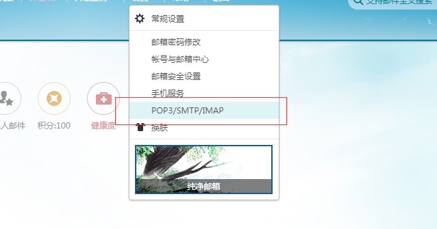
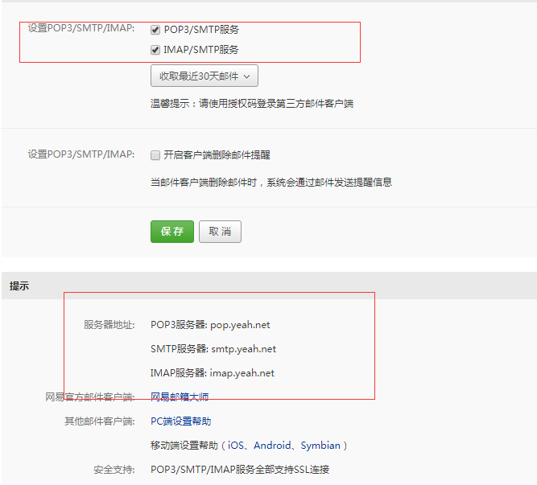

## 业务场景
> 最近在做一个关于bug收集的库，其中需要收集崩溃日志信息并在后台发送邮件给开发者。有三种方式可以实现当前的需求：1、苹果的自带的发送邮件方式。2、开源库SKPSMTPMessage 3、第三方库MailCore2。需要实现发邮件需求的同学请直接阅读第三章节。
<!-- more -->
## 苹果自带发送邮件
本来想把发送邮件的代码也贴上，但是实话说这个没有什么卵用（个人觉得），界面丑到爆。而且需要手动去发送数据和个人的业务需求不符。（也可以理解为我懒😯）

## SKPSMTPMessage

SKPSMTPMessage是一个开源的发送邮件第三方库，但是作者在两年前已经停止更新。收到的邮件标题会有乱码的。（按有的同学推荐去处理过但并没有什卵用····）

```apple 
    SKPSMTPMessage *testMsg = [[SKPSMTPMessage alloc] init];
    //发送者
    testMsg.fromEmail = @"xyhuangjia@yeah.net";
    //发送给
    testMsg.toEmail = @"huangj@ywsoftware.com";
    //抄送联系人列表，如：@"664742641@qq.com;1@qq.com;2@q.com;3@qq.com"
    //    testMsg.ccEmail = @"lanyuu@live.cn";
    //    //密送联系人列表，如：@"664742641@qq.com;1@qq.com;2@q.com;3@qq.com"
    //    testMsg.bccEmail = @"664742641@qq.com";
    //发送邮箱的发送服务器地址
    testMsg.relayHost = @"smtp.yeah.net";
    //需要鉴权
    testMsg.requiresAuth = YES;
    //发送者的登录账号
    testMsg.login = @"xyhuangjia@yeah.net";
    //发送者的登录密码
    testMsg.pass = @"HJ19930112";
    //邮件主题
    testMsg.subject = [NSString stringWithCString:"来自iphone socket的测试邮件" encoding:NSUTF8StringEncoding ];
//    testMsg.subject = @"测试数据";
    
    testMsg.wantsSecure = YES; // smtp.gmail.com doesn't work without TLS!
    
    // Only do this for self-signed certs!
    // testMsg.validateSSLChain = NO;
    testMsg.delegate = self;
    
    //主题
    NSDictionary *plainPart = [NSDictionary dictionaryWithObjectsAndKeys:@"text/plain",kSKPSMTPPartContentTypeKey,
                               @"This is a test message.\r\n支持中文。",kSKPSMTPPartMessageKey,@"8bit",kSKPSMTPPartContentTransferEncodingKey,nil];
    
    //附件
    NSString *vcfPath = [[NSBundle mainBundle] pathForResource:@"video.jpg" ofType:@""];
    NSData *vcfData = [NSData dataWithContentsOfFile:vcfPath];
    
    //附件图片文件
    NSDictionary *vcfPart = [[NSDictionary alloc ]initWithObjectsAndKeys:@"text/directory;\r\n\tx-unix-mode=0644;\r\n\tname=\"video.jpg\"",kSKPSMTPPartContentTypeKey,
                             @"attachment;\r\n\tfilename=\"video.jpg\"",kSKPSMTPPartContentDispositionKey,[vcfData encodeBase64ForData],kSKPSMTPPartMessageKey,@"base64",kSKPSMTPPartContentTransferEncodingKey,nil];
    //附件音频文件
    NSString *wavPath = [[NSBundle mainBundle] pathForResource:@"push" ofType:@"wav"];
    NSData *wavData = [NSData dataWithContentsOfFile:wavPath];
    NSDictionary *wavPart = [[NSDictionary alloc ]initWithObjectsAndKeys:@"text/directory;\r\n\tx-unix-mode=0644;\r\n\tname=\"push.wav\"",kSKPSMTPPartContentTypeKey,
                             @"attachment;\r\n\tfilename=\"push.wav\"",kSKPSMTPPartContentDispositionKey,[wavData encodeBase64ForData],kSKPSMTPPartMessageKey,@"base64",kSKPSMTPPartContentTransferEncodingKey,nil];
//    testMsg.parts = [NSArray arrayWithObjects:plainPart,vcfPart,wavPart, nil];
    testMsg.parts = [NSArray arrayWithObjects:plainPart, nil];
    [testMsg send];


```
设置代理
```apple 
   //MARK: SKPSMTPMessageDelegate
   - (void)messageSent:(SKPSMTPMessage *)message
   {
       NSLog(@"send success");
   //    [self.view makeToast:@"发送邮件成功" duration:1 position:@"center"];
   }
   - (void)messageFailed:(SKPSMTPMessage *)message error:(NSError *)error
   {
   //    [self.view makeToast:[NSString stringWithFormat:@"发送邮件失败nerror - %@",error] duration:1 position:@"center"];
       NSLog(@"message - %@\nerror - %@", message, error);
   }
```

## MailCore2发送邮件
### MailCore2是什么？
 MailCore2是一个很强大的邮件处理第三方库。MailCore 2提供了一个简单而异步的Objective-C API来处理电子邮件协议IMAP，POP和SMTP。支持多种平台。。。这个如果有兴趣的话可以去看一下，[传送门](https://github.com/MailCore/mailcore2)
### 如何配置
使用stmp协议发送邮件的话需要获取邮箱独立密码，我以自己的网易云邮箱作为案例来进行配置一波
第一次选择这个

然后

大写的尴尬。。。。。。。
还是给个官方的传送门得了，[传送门在此](http://help.163.com/10/0312/13/61J0LI3200752CLQ.html)
### 重要参数 
 #### 一、用户名密码
 登录邮箱的发送者账号和密码（独立的邮箱密码，和登录邮箱密码不同，申请方式见如何配置部分）
```apple
NSString * userName = @"xyhuangjia@yeah.net";
NSString * passWord = @"不给你看";
smtpSession.username = userName;
smtpSession.password = passWord; 
```
#### 二、接受者的账号
可以直接填写邮件接收人和抄送以及密送人员名单，基本可以实现pc端邮件发送的功能
```apple
    NSMutableArray *to = [[NSMutableArray alloc] init];
    NSArray * recipients = @[@"2587171762@qq.com",@"huangj@ywsoftware.com"];//,@"748781314@qq.com",@"huangj@ywsoftware.com"
    for(NSString *toAddress in recipients) {
        MCOAddress *newAddress = [MCOAddress addressWithMailbox:toAddress];
        [to addObject:newAddress];
    }
    [[builder header] setTo:to];
```
## 示例代码

```apple
    MCOSMTPSession *smtpSession = [[MCOSMTPSession alloc] init];
    smtpSession.hostname = @"smtp.yeah.net";
    smtpSession.port = 465;
    NSString * userName = @"xyhuangjia@yeah.net";
    NSString * passWord = @"不给你看";
    smtpSession.username = userName;
    smtpSession.password = passWord;
    smtpSession.connectionType = MCOConnectionTypeTLS;
    
    MCOMessageBuilder * builder = [[MCOMessageBuilder alloc] init];
    [[builder header] setFrom:[MCOAddress addressWithDisplayName:@"黄佳" mailbox:userName]];
    /*接收人员名单*/
    NSMutableArray *to = [[NSMutableArray alloc] init];
    NSArray * recipients = @[@"2587171762@qq.com",@"huangj@ywsoftware.com"];//,@"748781314@qq.com",@"huangj@ywsoftware.com"
    for(NSString *toAddress in recipients) {
        MCOAddress *newAddress = [MCOAddress addressWithMailbox:toAddress];
        [to addObject:newAddress];
    }
    [[builder header] setTo:to];
    //抄送
    //    NSMutableArray *cc = [[NSMutableArray alloc] init];
    //    for(NSString *ccAddress in CC) {
    //        MCOAddress *newAddress = [MCOAddress addressWithMailbox:ccAddress];
    //        [cc addObject:newAddress];
    //    }
    //    [[builder header] setCc:cc];
    //     /*密送*/
    //    NSMutableArray *bcc = [[NSMutableArray alloc] init];
    //    for(NSString *bccAddress in BCC) {
    //        MCOAddress *newAddress = [MCOAddress addressWithMailbox:bccAddress];
    //        [bcc addObject:newAddress];
    //    }
    //    [[builder header] setBcc:bcc];
    NSDictionary *infoDictionary = [[NSBundle mainBundle] infoDictionary];
    // app名称  
    NSString *app_Name = [infoDictionary objectForKey:@"CFBundleDisplayName"]; 
    //标题 
    NSString * subject = [NSString stringWithFormat:@"%@的Crash报告",app_Name];
    [[builder header] setSubject:subject];
    /*正文*/
//    [builder setHTMLBody:[self createHTML:crashDictionary]];
    
    /*
     *栈信息放在附件信息里，发送给开发者。
     */
    NSData * rfc822Data = [builder data];
    
    MCOSMTPSendOperation *sendOperation = [smtpSession sendOperationWithData:rfc822Data];
    [sendOperation start:^(NSError *error) {
        if(error) {
            NSLog(@"%@ Error sending email:%@", userName, error);
        } else {
            NSLog(@"%@ 成功的发送了邮件", userName);
        }
    }];
```
<!-- ## 后记

经过实践两个库都能满足基本的需求， -->
