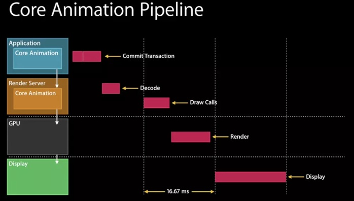
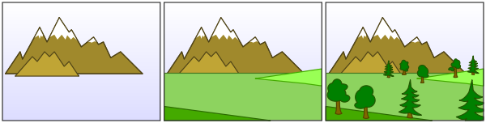

### 什么是离屏渲染
<!--more-->
如果要在显示屏上显示内容，我们至少需要一块与屏幕像素数据量一样大的frame buffer，作为像素数据存储区域，而这也是GPU存储渲染结果的地方。如果有时因为面临一些限制，无法把渲染结果直接写入frame buffer，而是先暂存在另外的内存区域，之后再写入frame buffer，那么这个过程被称之为离屏渲染。

主要的渲染操作是由CoreAnimation的Render Server模块，通过调用显卡驱动提供的OpenGL或Metal接口执行，对于每一层layer，Render Server会遵循“[画家算法](https://link.zhihu.com/?target=https%3A//en.wikipedia.org/wiki/Painter%27s_algorithm)”（由远及近），按次序输出到frame buffer，然后按照次序绘制到屏幕，当绘制完一层，就会将该层从帧缓存区中移除（以节省空间）如下图，从左至右依次输出，得到最后的显示结果。

但在某些场景下“画家算法”虽然可以逐层输出，但是无法在某一层渲染完成后，在回过头来擦除/修改某一部分，因为这一层之前的layer像素数据已经被永久覆盖了。这就意味着<u>对于每一层的layer要么能够通过单次遍历就能完成渲染，要么就只能令开辟一块内存作为临时中转区来完成复杂的修改/裁剪等操作</u>。

### 常见场景

- cornerRadius+clipsToBounds，原因就如同上面提到的，不得已只能另开一块内存来操作。而如果只是设置cornerRadius（如不需要剪切内容，只需要一个带圆角的边框），或者只是需要裁掉矩形区域以外的内容（虽然也是剪切，但是稍微想一下就可以发现，对于纯矩形而言，实现这个算法似乎并不需要另开内存），并不会触发离屏渲染。
- shadow，其原因在于，虽然layer本身是一块矩形区域，但是阴影默认是作用在其中”非透明区域“的，而且需要显示在所有layer内容的下方，因此根据画家算法必须被渲染在先。但矛盾在于**此时阴影的本体（layer和其子layer）都还没有被组合到一起，怎么可能在第一步就画出只有完成最后一步之后才能知道的形状呢**？这样一来又只能另外申请一块内存，把本体内容都先画好，再根据渲染结果的形状，添加阴影到frame buffer，最后把内容画上去（这只是我的猜测，实际情况可能更复杂）。不过如果我们能够预先告诉CoreAnimation（通过shadowPath属性）阴影的几何形状，那么阴影当然可以先被独立渲染出来，不需要依赖layer本体，也就不再需要离屏渲染了。
- group opacity，其实从名字就可以猜到，alpha并不是分别应用在每一层之上，而是只有到整个layer树画完之后，再统一加上alpha，最后和底下其他layer的像素进行组合。显然也无法通过一次遍历就得到最终结果。
- mask，我们知道mask是应用在layer和其所有子layer的组合之上的，而且可能带有透明度，那么其实和group opacity的原理类似，不得不在离屏渲染中完成。

### 有何影响

GPU的操作是高度流水线化的。本来所有计算工作都在有条不紊地正在向frame buffer输出，此时突然收到指令，需要输出到另一块内存，那么流水线中正在进行的一切都不得不被丢弃，切换到只能服务于我们当前的“切圆角”操作。等到完成以后再次清空，再回到向frame buffer输出的正常流程。

在tableView或者collectionView中，滚动的每一帧变化都会触发每个cell的重新绘制，因此一旦存在离屏渲染，上面提到的上下文切换就会每秒发生60次，并且很可能每一帧有几十张的图片要求这么做，对于GPU的性能冲击可想而知（GPU非常擅长大规模并行计算，但是我想频繁的上下文切换显然不在其设计考量之中）

### 该怎么办

- 如果产品设计圆角+阴影的卡片，可以使用切图实现圆角+阴影，避免触发离屏渲染
- 贝塞尔曲线绘制圆角
- CAShapeLayer + UIBezierPath 绘制圆角来实现UITableViewCell圆角并绘制边框颜色（这种方式比直接设置圆角方式好，但也会触发离屏渲染，优点是性能高）

- 缓存运算结果，下一帧复用。例如`CALayer`的`shouldRasterize`。
- 调用CPU 运算。

### 参考文章

[关于iOS离屏渲染的深入研究](https://zhuanlan.zhihu.com/p/72653360)

